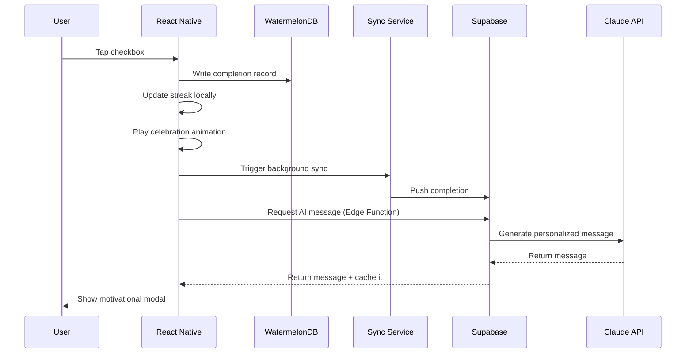

# 🧠 TO DO BETTER — Core Knowledge Base

> **This is the single source of truth for the "To Do Better" app.**
> Any AI assistant or developer should read this document first before writing any code.
> Update this document whenever a major decision changes.

---

## 1. App Identity

| Field | Value |
|---|---|
| **Name** | To Do Better |
| **Platforms** | iOS & Android (single codebase) |
| **Tagline** | AI-powered habit & task tracker that celebrates your wins |
| **Core value** | Personalized motivation that learns your patterns |

---

## 2. Technical Stack

### 2.1 Frontend

| Technology | Version | Purpose |
|---|---|---|
| React Native | 0.73+ | Cross-platform mobile framework |
| Expo SDK | 50+ | Build tooling, OTA updates, native modules |
| TypeScript | 5.0+ | Type-safe development |
| React Navigation | 6.x | Screen routing & deep linking |
| Zustand | 4.x | Lightweight global state management |
| WatermelonDB | 0.27+ | High-performance local SQLite database |
| react-native-reanimated | 3.x | 60 fps animations & gestures |
| react-native-svg | — | Calendar heatmap rendering |
| expo-notifications | — | Local & push notifications |
| react-native-google-mobile-ads | — | AdMob banner & interstitial ads |
| react-native-purchases | — | RevenueCat subscription management |

### 2.2 Backend

| Technology | Purpose |
|---|---|
| Supabase | PostgreSQL DB, Auth, Realtime, Storage |
| Supabase Edge Functions (Deno) | Serverless API endpoints |
| Anthropic Claude API (Sonnet) | AI-generated motivational messages |
| Supabase Auth | Email, Google, Apple sign-in |

### 2.3 DevOps & Tooling

| Tool | Purpose |
|---|---|
| Git + GitHub | Version control |
| EAS Build | Expo cloud builds for iOS & Android |
| GitHub Actions + EAS | CI/CD pipeline |
| Sentry | Error & crash tracking |
| PostHog / Mixpanel | Product analytics |
| Postman / Insomnia | API testing during development |

---

## 3. Architecture Overview

### 3.1 Pattern: Local-First with Cloud Sync

```
┌─────────────────────────────────────────────┐
│                  Mobile App                  │
│  ┌───────────┐   ┌──────────┐   ┌────────┐ │
│  │  Zustand   │──▶│  Screens │──▶│   UI   │ │
│  │  (state)   │   │  & Logic │   │Comps   │ │
│  └─────┬─────┘   └────┬─────┘   └────────┘ │
│        │              │                      │
│  ┌─────▼──────────────▼─────┐               │
│  │      WatermelonDB         │  ◀── offline  │
│  │    (local SQLite)         │      first    │
│  └──────────┬───────────────┘               │
└─────────────┼───────────────────────────────┘
              │  sync (pull/push)
              ▼
┌─────────────────────────────────────────────┐
│               Supabase Cloud                 │
│  ┌──────────┐  ┌────────┐  ┌─────────────┐ │
│  │ PostgreSQL│  │  Auth  │  │ Edge Funcs  │ │
│  │ (tables)  │  │(users) │  │ (AI calls)  │ │
│  └──────────┘  └────────┘  └──────┬──────┘ │
└────────────────────────────────────┼────────┘
                                     │
                              ┌──────▼──────┐
                              │ Claude API  │
                              │ (Anthropic) │
                              └─────────────┘
```

**Why local-first?** The app stores all data on-device first (WatermelonDB), then syncs to Supabase in the background. This guarantees:
- Instant UI responsiveness — no loading spinners for CRUD
- Full offline support — users can complete habits on a plane
- Conflict resolution via "last write wins" with timestamps

### 3.2 Data Flow — Completing a Habit



---

## 4. Database Schema

### 4.1 Supabase (Cloud — PostgreSQL)

#### `users`
```sql
CREATE TABLE users (
  id            UUID PRIMARY KEY DEFAULT uuid_generate_v4(),
  auth_id       UUID REFERENCES auth.users(id) UNIQUE NOT NULL,
  name          VARCHAR(100),
  email         VARCHAR(255) UNIQUE NOT NULL,
  timezone      VARCHAR(50) DEFAULT 'UTC',
  notification_preferences JSONB DEFAULT '{"enabled": true, "sound": true}',
  is_premium    BOOLEAN DEFAULT false,
  premium_expires_at TIMESTAMP,
  created_at    TIMESTAMP DEFAULT NOW(),
  updated_at    TIMESTAMP DEFAULT NOW()
);
```

#### `habits`
```sql
CREATE TABLE habits (
  id               UUID PRIMARY KEY DEFAULT uuid_generate_v4(),
  user_id          UUID REFERENCES users(id) ON DELETE CASCADE,
  title            VARCHAR(200) NOT NULL,
  description      TEXT,
  recurrence_type  VARCHAR(20) NOT NULL,       -- 'daily' | 'weekly' | 'custom'
  recurrence_config JSONB NOT NULL,            -- e.g. {"days":[1,3,5],"time":"09:00"}
  reminder_enabled BOOLEAN DEFAULT true,
  reminder_time    TIME,
  color            VARCHAR(7) DEFAULT '#6366f1',
  icon             VARCHAR(50),
  is_archived      BOOLEAN DEFAULT false,
  created_at       TIMESTAMP DEFAULT NOW(),
  updated_at       TIMESTAMP DEFAULT NOW(),
  deleted_at       TIMESTAMP                    -- soft delete
);
```

#### `one_time_tasks`
```sql
CREATE TABLE one_time_tasks (
  id            UUID PRIMARY KEY DEFAULT uuid_generate_v4(),
  user_id       UUID REFERENCES users(id) ON DELETE CASCADE,
  title         VARCHAR(200) NOT NULL,
  description   TEXT,
  due_date      DATE,
  priority      VARCHAR(20) DEFAULT 'medium',  -- 'low' | 'medium' | 'high'
  is_completed  BOOLEAN DEFAULT false,
  completed_at  TIMESTAMP,
  created_at    TIMESTAMP DEFAULT NOW(),
  updated_at    TIMESTAMP DEFAULT NOW(),
  deleted_at    TIMESTAMP
);
```

#### `completions`
```sql
CREATE TABLE completions (
  id            UUID PRIMARY KEY DEFAULT uuid_generate_v4(),
  user_id       UUID REFERENCES users(id) ON DELETE CASCADE,
  habit_id      UUID REFERENCES habits(id) ON DELETE CASCADE,
  completed_at  TIMESTAMP NOT NULL,
  date          DATE NOT NULL,                 -- denormalized for fast queries
  ai_message    TEXT,
  created_at    TIMESTAMP DEFAULT NOW()
);

CREATE INDEX idx_completions_user_date  ON completions(user_id, date);
CREATE INDEX idx_completions_habit_date ON completions(habit_id, date);
```

#### `streaks`
```sql
CREATE TABLE streaks (
  id                  UUID PRIMARY KEY DEFAULT uuid_generate_v4(),
  user_id             UUID REFERENCES users(id) ON DELETE CASCADE,
  habit_id            UUID REFERENCES habits(id) ON DELETE CASCADE,
  current_streak      INT DEFAULT 0,
  longest_streak      INT DEFAULT 0,
  last_completed_date DATE,
  updated_at          TIMESTAMP DEFAULT NOW(),
  UNIQUE(habit_id)
);
```

#### `ai_messages_cache`
```sql
CREATE TABLE ai_messages_cache (
  id         UUID PRIMARY KEY DEFAULT uuid_generate_v4(),
  user_id    UUID REFERENCES users(id) ON DELETE CASCADE,
  habit_id   UUID REFERENCES habits(id) ON DELETE CASCADE,
  task_id    UUID REFERENCES one_time_tasks(id) ON DELETE CASCADE,
  message    TEXT NOT NULL,
  context    JSONB,        -- stores streak, habit name, etc.
  created_at TIMESTAMP DEFAULT NOW()
);
```

### 4.2 WatermelonDB (Local — SQLite)

Mirrors the cloud schema for offline-first support. Key differences:
- Each local table has a `remote_id` column (nullable) that maps to the Supabase UUID after first sync.
- Timestamps stored as Unix epoch numbers (WatermelonDB convention).
- `recurrence_config` stored as a JSON string.

```typescript
// model/schema.ts
import { appSchema, tableSchema } from '@nozbe/watermelondb';

export default appSchema({
  version: 1,
  tables: [
    tableSchema({
      name: 'habits',
      columns: [
        { name: 'remote_id',         type: 'string',  isOptional: true },
        { name: 'user_id',           type: 'string' },
        { name: 'title',             type: 'string' },
        { name: 'description',       type: 'string',  isOptional: true },
        { name: 'recurrence_type',   type: 'string' },
        { name: 'recurrence_config', type: 'string' }, // JSON string
        { name: 'reminder_enabled',  type: 'boolean' },
        { name: 'reminder_time',     type: 'string',  isOptional: true },
        { name: 'color',             type: 'string' },
        { name: 'icon',              type: 'string',  isOptional: true },
        { name: 'is_archived',       type: 'boolean' },
        { name: 'created_at',        type: 'number' },
        { name: 'updated_at',        type: 'number' },
        { name: 'deleted_at',        type: 'number',  isOptional: true },
      ],
    }),
    tableSchema({
      name: 'one_time_tasks',
      columns: [
        { name: 'remote_id',     type: 'string',  isOptional: true },
        { name: 'user_id',       type: 'string' },
        { name: 'title',         type: 'string' },
        { name: 'description',   type: 'string',  isOptional: true },
        { name: 'due_date',      type: 'number',  isOptional: true },
        { name: 'priority',      type: 'string' },
        { name: 'is_completed',  type: 'boolean' },
        { name: 'completed_at',  type: 'number',  isOptional: true },
        { name: 'created_at',    type: 'number' },
        { name: 'updated_at',    type: 'number' },
      ],
    }),
    tableSchema({
      name: 'completions',
      columns: [
        { name: 'remote_id',    type: 'string',  isOptional: true },
        { name: 'user_id',      type: 'string' },
        { name: 'habit_id',     type: 'string' },
        { name: 'completed_at', type: 'number' },
        { name: 'date',         type: 'number' },
        { name: 'ai_message',   type: 'string',  isOptional: true },
        { name: 'created_at',   type: 'number' },
      ],
    }),
    tableSchema({
      name: 'streaks',
      columns: [
        { name: 'remote_id',           type: 'string',  isOptional: true },
        { name: 'user_id',             type: 'string' },
        { name: 'habit_id',            type: 'string' },
        { name: 'current_streak',      type: 'number' },
        { name: 'longest_streak',      type: 'number' },
        { name: 'last_completed_date', type: 'number',  isOptional: true },
        { name: 'updated_at',          type: 'number' },
      ],
    }),
  ],
});
```

---

## 5. Folder Structure

```
to-do-better/
├── app/
│   ├── components/
│   │   ├── habits/
│   │   │   ├── HabitCard.tsx          # Single habit row + checkbox
│   │   │   ├── HabitForm.tsx          # Create/edit habit modal
│   │   │   ├── RecurrenceSelector.tsx # Day picker & frequency UI
│   │   │   └── StreakBadge.tsx         # 🔥 streak counter pill
│   │   ├── tasks/
│   │   │   ├── TaskCard.tsx           # Single task row
│   │   │   └── TaskForm.tsx           # Create/edit task modal
│   │   ├── calendar/
│   │   │   ├── HeatmapGrid.tsx        # GitHub-style contribution graph
│   │   │   └── DayDetailModal.tsx     # Tap a day → see completions
│   │   ├── shared/
│   │   │   ├── Button.tsx
│   │   │   ├── Input.tsx
│   │   │   ├── ConfettiAnimation.tsx  # Celebration on completion
│   │   │   └── MotivationModal.tsx    # Shows AI message
│   │   └── ads/
│   │       ├── BannerAd.tsx           # Bottom banner (free tier)
│   │       └── InterstitialAd.tsx     # Full-screen ad (1×/day)
│   ├── screens/
│   │   ├── HomeScreen.tsx             # Habits + Tasks lists
│   │   ├── CalendarScreen.tsx         # Heatmap + day details
│   │   ├── ProfileScreen.tsx          # Settings & premium
│   │   ├── AuthScreen.tsx             # Login / Sign-up
│   │   └── PaywallScreen.tsx          # Premium upgrade UI
│   ├── navigation/
│   │   └── AppNavigator.tsx           # Tab + stack navigators
│   ├── models/
│   │   ├── schema.ts                  # WatermelonDB schema
│   │   ├── Habit.ts                   # WatermelonDB model class
│   │   ├── Task.ts
│   │   ├── Completion.ts
│   │   └── Streak.ts
│   ├── services/
│   │   ├── supabase.ts                # Supabase client init
│   │   ├── sync.ts                    # WatermelonDB ↔ Supabase sync
│   │   ├── notifications.ts           # Expo notification helpers
│   │   ├── ai.ts                      # AI message request client
│   │   └── analytics.ts              # PostHog / Mixpanel wrapper
│   ├── stores/
│   │   ├── authStore.ts               # User session & premium status
│   │   ├── habitStore.ts              # Habit CRUD actions
│   │   └── settingsStore.ts           # Notification prefs, theme
│   ├── utils/
│   │   ├── dateHelpers.ts             # Date formatting & comparison
│   │   ├── streakCalculator.ts        # Streak logic (see §6.1)
│   │   └── recurrenceEngine.ts        # Recurrence logic (see §6.2)
│   └── constants/
│       ├── colors.ts                  # Design tokens
│       └── config.ts                  # Feature flags & env keys
├── supabase/
│   └── functions/
│       ├── generate-motivation/
│       │   └── index.ts               # Claude API Edge Function
│       └── sync-handler/
│           └── index.ts               # Server-side sync endpoint
├── app.json                           # Expo config
├── package.json
├── tsconfig.json
└── TO_DO_BETTER_BRAIN.md              # ← You are here
```

---

## 6. Core Algorithms

### 6.1 Recurrence Engine

Determines whether a habit is due on a given date.

```typescript
// utils/recurrenceEngine.ts

interface RecurrenceConfig {
  type: 'daily' | 'weekly' | 'custom';
  days?: number[];   // 0=Sun … 6=Sat (for weekly)
  time?: string;     // "HH:mm"
  interval?: number; // every N days (for custom)
}

export class RecurrenceEngine {
  /** Returns true if the habit should appear on `date`. */
  static isDueOnDate(config: RecurrenceConfig, date: Date): boolean {
    switch (config.type) {
      case 'daily':
        return true;
      case 'weekly':
        return config.days?.includes(date.getDay()) ?? false;
      case 'custom':
        return this.checkCustomRecurrence(config, date);
      default:
        return false;
    }
  }

  /** Returns the next N dates on which the habit is due. */
  static getNextOccurrences(
    config: RecurrenceConfig,
    from: Date,
    count: number
  ): Date[] {
    const result: Date[] = [];
    const cursor = new Date(from);
    cursor.setHours(0, 0, 0, 0);

    while (result.length < count) {
      if (this.isDueOnDate(config, cursor)) {
        result.push(new Date(cursor));
      }
      cursor.setDate(cursor.getDate() + 1);
    }
    return result;
  }

  private static checkCustomRecurrence(
    config: RecurrenceConfig,
    date: Date
  ): boolean {
    // e.g. "every 3 days" from habit creation date
    // Implementation depends on storing a start_date in the habit
    return false; // placeholder
  }
}
```

### 6.2 Streak Calculator

Walks backward from today to compute current & longest streaks.

```typescript
// utils/streakCalculator.ts

export class StreakCalculator {
  static calculate(
    completions: { date: Date }[],
    config: RecurrenceConfig,
    today: Date
  ): { current: number; longest: number; broken: boolean } {
    const completionSet = new Set(
      completions.map(c => c.date.toISOString().split('T')[0])
    );

    let current = 0;
    let longest = 0;
    let temp = 0;
    let broken = false;
    const cursor = new Date(today);

    for (let i = 0; i < 365; i++) {
      const key = cursor.toISOString().split('T')[0];
      const wasDue = RecurrenceEngine.isDueOnDate(config, cursor);

      if (wasDue) {
        if (completionSet.has(key)) {
          temp++;
        } else {
          if (i === 0) broken = true;
          longest = Math.max(longest, temp);
          temp = 0;
        }
      }
      cursor.setDate(cursor.getDate() - 1);
    }

    current = broken ? 0 : temp; // temp holds the active run from today
    longest = Math.max(longest, temp);
    return { current, longest, broken };
  }
}
```

> **Important nuance:** For `weekly` habits, non-due days are skipped — they don't break the streak. A habit due Mon/Wed/Fri with completions on all three days has a streak of 3, not 5.

---

## 7. Core Features — Implementation Notes

### 7.1 AI Motivational Messages

| Aspect | Detail |
|---|---|
| **Trigger** | User completes a habit or task |
| **Backend** | Supabase Edge Function calls Claude API |
| **Rate limit (free)** | 5 AI messages per 24 hours |
| **Rate limit (premium)** | Unlimited |
| **Fallback** | If API fails or limit reached → use static template: *"Great job! Keep it up! 🎉"* |
| **Caching** | Every AI message is stored in `ai_messages_cache` for history |
| **Latency target** | < 3 seconds end-to-end |

**Prompt template** (sent from Edge Function):
```
You are an enthusiastic personal cheerleader. Generate a brief,
personalized motivational message (2-3 sentences max) for {userName}
who just completed: "{habitTitle}".

Context:
- Current streak: {currentStreak} days
- Longest streak: {longestStreak} days
- This is a {recurrenceType} habit

Make it warm, genuine, specific to the task, and under 40 words.
Include one relevant emoji. Generate ONLY the message.
```

### 7.2 Sync System

Uses WatermelonDB's built-in `synchronize()` with custom Supabase RPC endpoints.

| Direction | Mechanism |
|---|---|
| **Pull** | `supabase.rpc('pull_changes', { last_pulled_at })` → returns created/updated/deleted records since timestamp |
| **Push** | `supabase.rpc('push_changes', { changes })` → upserts local changes to cloud |
| **Conflict** | "Last write wins" using `updated_at` timestamp |
| **Realtime** | Supabase Realtime channel listens for changes → triggers local sync |
| **Offline** | All CRUD works locally; sync queues until connectivity returns |

### 7.3 Notification System

| Feature | Implementation |
|---|---|
| **Library** | `expo-notifications` |
| **Type** | Local scheduled notifications (no server needed) |
| **Scheduling** | When a habit is created/edited, schedule next 30 occurrences |
| **Refresh** | Re-schedule whenever the app opens (or habit changes) |
| **Cancel** | Remove all notifications for a habit when it's deleted/archived |
| **Permissions** | Requested during onboarding; graceful fallback if denied |

### 7.4 Calendar Heatmap

- Renders last 365 days as a grid of colored squares (like GitHub contributions).
- Color intensity scales with number of completions per day (0 → gray, 1-2 → light green, 3-4 → medium, 5+ → dark green).
- Built with `react-native-svg` `<Rect>` elements for full control over tap handlers and animations.
- Tapping a day opens `DayDetailModal` showing which habits/tasks were completed.

---

## 8. Screens & Navigation

### 8.1 Navigation Structure

```
AppNavigator (Stack)
├── AuthScreen           (unauthenticated)
├── MainTabs (Bottom Tab Navigator)
│   ├── HomeScreen       (tab: "Today")
│   ├── CalendarScreen   (tab: "Calendar")
│   └── ProfileScreen    (tab: "Profile")
└── PaywallScreen        (modal overlay)
```

### 8.2 Screen Responsibilities

| Screen | Key Elements |
|---|---|
| **HomeScreen** | Tab toggle (Habits / Tasks), list of today's due habits or open tasks, FAB to create new, banner ad at bottom for free users |
| **CalendarScreen** | Month/year selector, heatmap grid, day detail modal, completion stats |
| **ProfileScreen** | User name/email, premium status badge, notification toggle, sign out, upgrade button |
| **AuthScreen** | Email + password, Google sign-in, Apple sign-in, sign up / log in toggle |
| **PaywallScreen** | Feature comparison (free vs premium), pricing, purchase button via RevenueCat |

---

## 9. Monetization

### 9.1 Free Tier
- All core features (habits, tasks, streaks, calendar)
- 5 AI-generated messages per day
- Banner ad on HomeScreen
- 1 interstitial ad per day (after first task completion)

### 9.2 Premium Tier — $2.99/month
- Unlimited AI-generated messages
- No ads
- Priority support
- Future: custom themes, data export

### 9.3 Tech Integration

| Service | SDK | Purpose |
|---|---|---|
| Google AdMob | `react-native-google-mobile-ads` | Banner + interstitial ads |
| RevenueCat | `react-native-purchases` | Subscription management across iOS & Android |

---

## 10. Environment Variables

```bash
# ── Supabase ──
SUPABASE_URL=https://xxxxx.supabase.co
SUPABASE_ANON_KEY=eyJhbGci...
SUPABASE_SERVICE_ROLE_KEY=eyJhbGci...   # backend only — NEVER in app

# ── Anthropic ──
ANTHROPIC_API_KEY=sk-ant-api03-...       # backend only

# ── AdMob ──
ADMOB_IOS_APP_ID=ca-app-pub-xxxxx~yyyyy
ADMOB_ANDROID_APP_ID=ca-app-pub-xxxxx~zzzzz

# ── RevenueCat ──
REVENUECAT_IOS_API_KEY=xxxx
REVENUECAT_ANDROID_API_KEY=yyyy

# ── Analytics / Errors ──
POSTHOG_API_KEY=phc_xxxxx
SENTRY_DSN=https://xxxxx@sentry.io/xxxxx
```

> **Security rule:** API keys for Claude and Supabase service role must ONLY exist in Supabase Edge Functions environment. The mobile app uses ONLY `SUPABASE_ANON_KEY`.

---

## 11. Development Phases

| Phase | Weeks | Goal | Deliverable |
|---|---|---|---|
| **1 — Foundation** | 1–2 | Expo project, WatermelonDB, basic UI components, navigation | Create / view / delete habits & tasks locally |
| **2 — Core Logic** | 3–4 | Recurrence engine, streak calculator, checkbox animations | Functional habit tracking with streaks |
| **3 — Calendar** | 5 | Heatmap grid, day detail modal, date filters | Visual progress tracking |
| **4 — Backend & Sync** | 6–7 | Supabase setup, auth, bidirectional sync, offline handling | Multi-device sync working |
| **5 — AI Integration** | 8–9 | Edge Function, Claude API, rate limiting, message cache | Personalized AI messages |
| **6 — Notifications** | 10 | Scheduled reminders, permissions, settings | Timely habit reminders |
| **7 — Monetization** | 11–12 | AdMob, RevenueCat, paywall UI, premium toggle | Revenue streams active |
| **8 — Polish** | 13–15 | Onboarding, empty states, loading skeletons, beta test | Production-ready |
| **9 — Launch** | 16 | Store assets, submissions, analytics, marketing | App live on both stores |

---

## 12. Analytics Events

```typescript
enum AnalyticsEvent {
  // Onboarding
  ONBOARDING_STARTED   = 'onboarding_started',
  ONBOARDING_COMPLETED = 'onboarding_completed',

  // Core actions
  HABIT_CREATED   = 'habit_created',
  TASK_CREATED    = 'task_created',
  HABIT_COMPLETED = 'habit_completed',
  TASK_COMPLETED  = 'task_completed',

  // Engagement
  STREAK_MILESTONE  = 'streak_milestone',   // 7, 30, 100 days
  CALENDAR_VIEWED   = 'calendar_viewed',
  AI_MESSAGE_VIEWED = 'ai_message_viewed',

  // Monetization
  PAYWALL_VIEWED   = 'paywall_viewed',
  PREMIUM_PURCHASED = 'premium_purchased',
  AD_CLICKED       = 'ad_clicked',

  // Retention
  NOTIFICATION_RECEIVED = 'notification_received',
  NOTIFICATION_OPENED   = 'notification_opened',
  DAILY_ACTIVE          = 'daily_active',
}
```

---

## 13. Performance Targets

| Metric | Target |
|---|---|
| App cold launch | < 2 seconds |
| Habit completion animation | 60 fps |
| Sync (1 year of data) | < 5 seconds |
| Calendar heatmap render | < 1 second for 365 days |
| AI message generation | < 3 seconds |

**Optimization strategies:**
- Lazy-load calendar months
- `React.memo` on list items
- Database indexes on `user_id`, `date`, `habit_id`
- Background sync only on active / WiFi
- Batch database writes during habit completion

---

## 14. Cost Estimates (Monthly at Scale)

| Service | Free Tier Limit | Paid Cost |
|---|---|---|
| Supabase | 50K MAU | $25/mo (Pro) |
| Claude API | — | ~$0.02 per 1K messages |
| RevenueCat | — | Free (1% of revenue) |
| AdMob | — | Free (30% revenue share) |
| Sentry | 5K events/mo | $26/mo |
| PostHog | 1M events/mo | Free |

**Example:** 10K users × 5 completions/day = 1.5M AI messages/month ≈ $30–45/month.

---

## 15. Testing Strategy

| Level | Focus | Tool |
|---|---|---|
| **Unit** | Recurrence engine, streak calculator, date helpers | Jest |
| **Integration** | Auth flow, CRUD + sync, notification scheduling | Jest + Supabase local |
| **E2E** | Onboarding, create→complete→view streak, purchase | Detox |

---

## 16. Launch Checklist

### Pre-Launch
- [ ] All features from roadmap complete
- [ ] Beta test with 20+ users for 2 weeks
- [ ] Fix all critical bugs
- [ ] Optimize app performance
- [ ] Set up Sentry error tracking
- [ ] Set up PostHog analytics
- [ ] Privacy policy & terms of service
- [ ] App store assets (icon, screenshots, descriptions)
- [ ] Support email configured
- [ ] RevenueCat products configured
- [ ] AdMob ad units created
- [ ] Test in-app purchases on both platforms

### Submission
- [ ] Apple App Store review (7–14 days)
- [ ] Google Play Store review (1–3 days)
- [ ] Prepare launch announcement
- [ ] Social media & landing page

### Post-Launch
- [ ] Monitor crash reports daily
- [ ] Respond to user reviews
- [ ] Track DAU, retention, revenue
- [ ] Plan first update based on feedback

---

## 17. Conventions & Rules

These rules apply to **all code written for this project**:

1. **TypeScript everywhere** — no `.js` files in the app directory.
2. **Functional components only** — no class-based React components.
3. **Named exports** — avoid `export default` except for screens.
4. **Date handling** — always use UTC internally; convert to user timezone only for display.
5. **Error boundaries** — wrap each screen in an error boundary that logs to Sentry.
6. **Soft deletes** — never `DELETE` rows; set `deleted_at` timestamp instead.
7. **Immutable state** — Zustand stores return new objects, never mutate.
8. **Accessibility** — every tappable element must have `accessibilityLabel`.

---

> **How to use this document:**
> 1. Read §1–§3 to understand what the app is and how it's built.
> 2. Read §4–§5 to understand the data model and code structure.
> 3. Read §6–§7 for implementation details of specific features.
> 4. Follow §11 for the build order.
> 5. Update this document whenever a major architectural decision changes.
